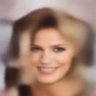

# Variational Autoencoder (VAE) from Scratch in PyTorch

## 🏁 Training

```bash
python train.py config.py --checkpoint-path /path/to/vae.pth
```

## 🎨 Inference

```bash
python inference.py config.py --checkpoint-path /path/to/vae.pth
```

## 🖼 Sample Generated Images From CelebA





